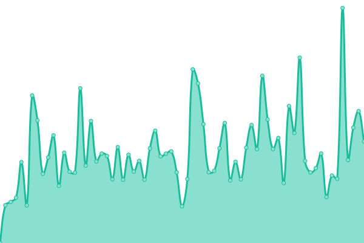

# [📈 Live Status](https://status.tr4sh.net): <!--live status--> **🟧 Partial outage**

This repository contains the open-source uptime monitor and status page for [dschense](https://127.0.0.1), powered by [Upptime](https://github.com/upptime/upptime).

With [Upptime](https://upptime.js.org), you can get your own unlimited and free uptime monitor and status page, powered entirely by a GitHub repository. We use [Issues](https://github.com/dschense/status/issues) as incident reports, [Actions](https://github.com/dschense/status/actions) as uptime monitors, and [Pages](https://status.tr4sh.net) for the status page.

<!--start: status pages-->
<!-- This summary is generated by Upptime (https://github.com/upptime/upptime) -->
<!-- Do not edit this manually, your changes will be overwritten -->
<!-- prettier-ignore -->
| URL | Status | History | Response Time | Uptime |
| --- | ------ | ------- | ------------- | ------ |
|  [Mail](https://mail.tr4sh.net) | 🟩 Up | [mail.yml](https://github.com/dschense/status/commits/master/history/mail.yml) | 

 1031ms
     
 | 

<a href="https://status.tr4sh.net/history/mail">100.00%</a>
    

|  [Mastodon](https://social.tr4sh.net) | 🟥 Down | [mastodon.yml](https://github.com/dschense/status/commits/master/history/mastodon.yml) | 

 1727ms
     
 | 

<a href="https://status.tr4sh.net/history/mastodon">100.00%</a>
    

|  [Bitwarden](https://vault.tr4sh.net) | 🟩 Up | [bitwarden.yml](https://github.com/dschense/status/commits/master/history/bitwarden.yml) | 

 1010ms
     
 | 

<a href="https://status.tr4sh.net/history/bitwarden">100.00%</a>
    

|  [Jitsi](https://videocall.tr4sh.net) | 🟩 Up | [jitsi.yml](https://github.com/dschense/status/commits/master/history/jitsi.yml) | 

 999ms
     
 | 

<a href="https://status.tr4sh.net/history/jitsi">100.00%</a>
    

|  [TinyRSS](https://tiny.tr4sh.net) | 🟩 Up | [tiny-rss.yml](https://github.com/dschense/status/commits/master/history/tiny-rss.yml) | 

 755ms
     
 | 

<a href="https://status.tr4sh.net/history/tiny-rss">100.00%</a>
    

|  [Wallabag](https://wallabag.tr4sh.net) | 🟩 Up | [wallabag.yml](https://github.com/dschense/status/commits/master/history/wallabag.yml) | 

 1293ms
     
 | 

<a href="https://status.tr4sh.net/history/wallabag">100.00%</a>
    

<!--end: status pages-->

[**Visit our status website →**](https://status.tr4sh.net)

## 📄 License

- Powered by: [Upptime](https://github.com/upptime/upptime)
- Code: [MIT](./LICENSE) © [dschense](https://127.0.0.1)
- Data in the `./history` directory: [Open Database License](https://opendatacommons.org/licenses/odbl/1-0/)
